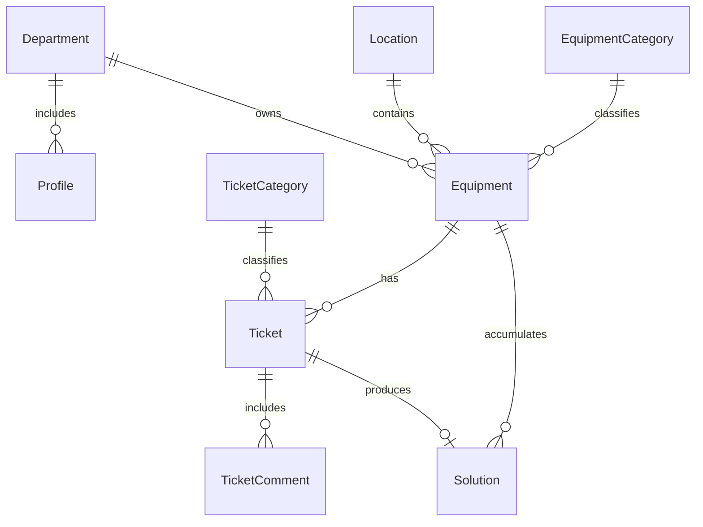
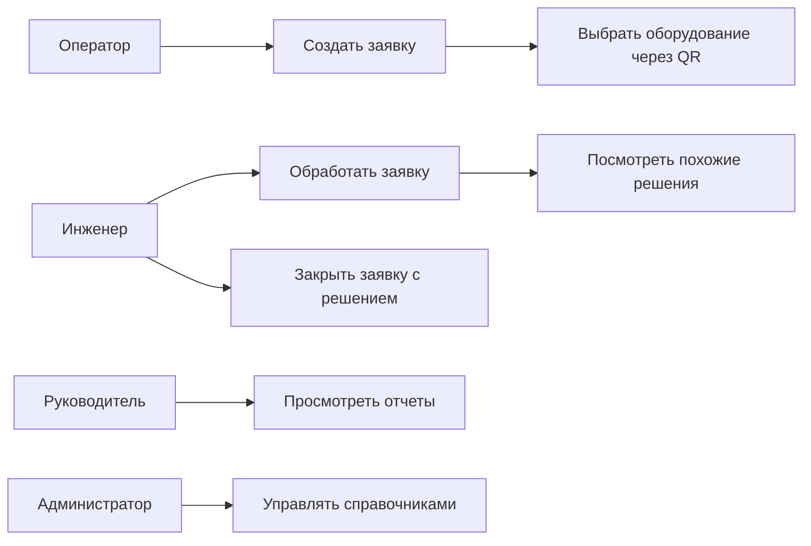

# Диаграммы для ВКР

## ERD

```mermaid
erDiagram
    Department ||--o{ Profile : includes
    Department ||--o{ Equipment : owns
    Location ||--o{ Equipment : contains
    EquipmentCategory ||--o{ Equipment : classifies
    TicketCategory ||--o{ Ticket : classifies
    Equipment ||--o{ Ticket : has
    Ticket ||--o{ TicketComment : includes
    Ticket ||--o| Solution : produces
    Equipment ||--o{ Solution : accumulates
```

## Use Case

```mermaid
flowchart LR
    Operator["Оператор"] --> CreateTicket["Создать заявку"]
    Engineer["Инженер"] --> ProcessTicket["Обработать заявку"]
    Engineer --> CloseTicket["Закрыть заявку с решением"]
    Manager["Руководитель"] --> Reports["Просмотреть отчеты"]
    Admin["Администратор"] --> ManageData["Управлять справочниками"]
    CreateTicket --> QR["Выбрать оборудование через QR"]
    ProcessTicket --> Similar["Посмотреть похожие решения"]
```
